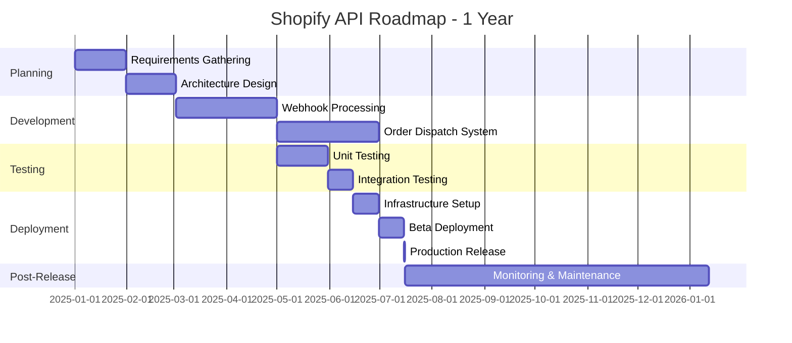
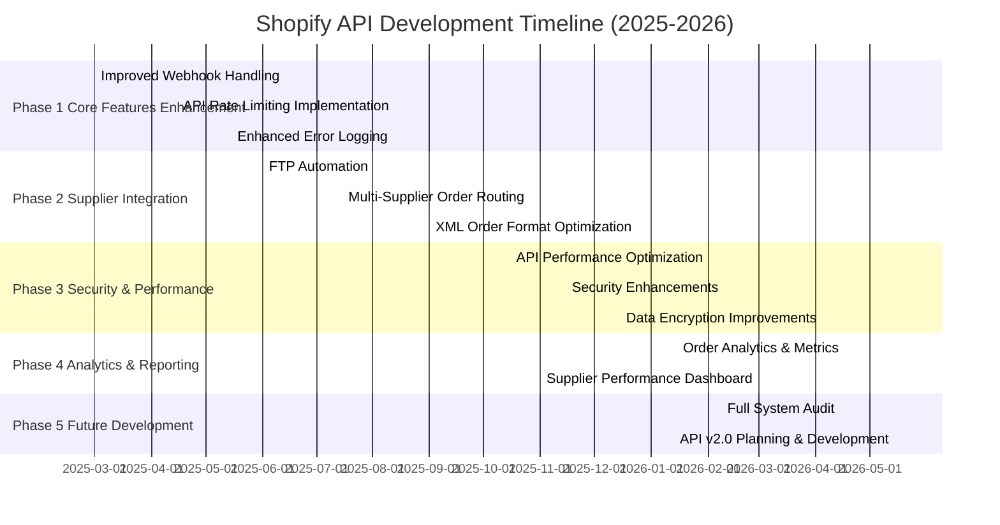

# 🚀 Shopify API Project Roadmap

This roadmap outlines the planned development and feature releases for the Shopify Order Management API over the next year. The timeline is subject to change based on feedback, technical requirements, and business priorities.

## 📅 Roadmap Overview

